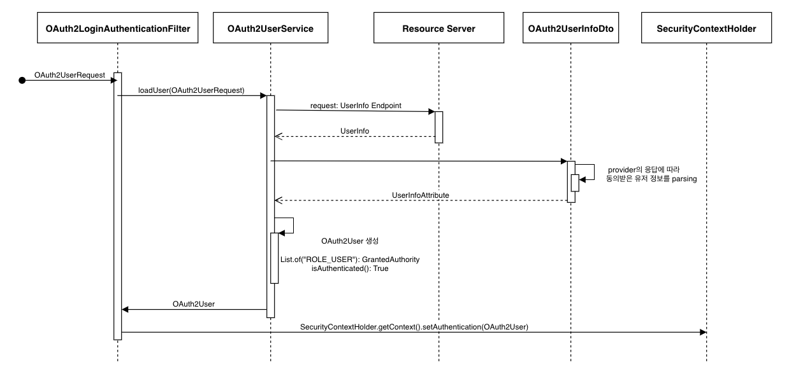
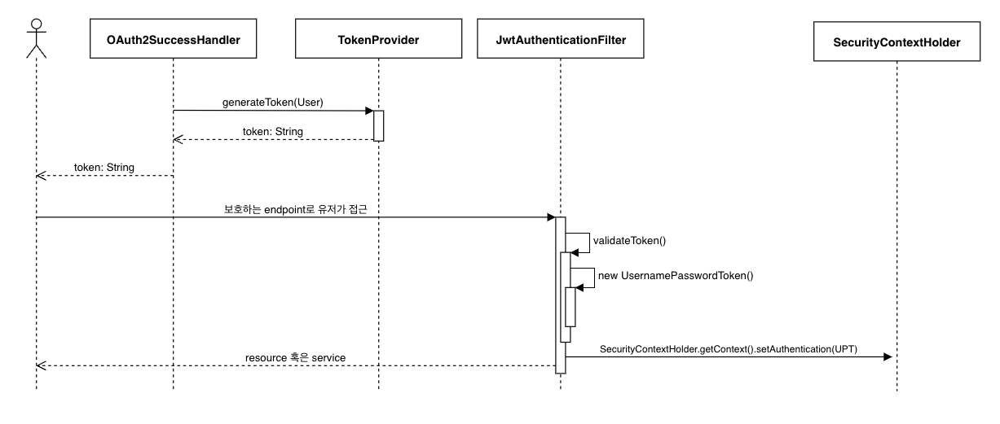

# toy-project-platform

## API 문서

<a href="https://shining-card-03b.notion.site/Rest-API-3132ab1f13a54100887add988d294108?pvs=4">
  Notion link  
</a>

   
  

  

## ppt

<a href="https://docs.google.com/presentation/d/1Yscm7k98Vgrge_egP0EVL1aXXOW2gEJyWoieuwWWqPg/edit?usp=sharing">
  Google slide
</a>

## Login Flow

### UserInfo endpoint

- Authorization Server로부터 access token을 받고 나면 위의 흐름대로 Resource owner의 동의된 정보를 가져오도록 구현
- 유저 정보가 등록되어 있지 않으면 userService.signUp()으로 user record 생성
- 성공적으로 SecurityContext에 Principal를 저장하면 OAuth2SuccessHandler에서 JWT를 생성하고 응답

### Validate Token

- 브라우저의 쿠키에 저장된 token을 이용해서 endpoint로 접근하면 JwtAuthenticationFilter에서 유효성을 검증
- 검증된 후에는 UsernamePasswordToken을 생성하고 SecurityContextHolder에 저장
- UsernamePasswordToken은 JWT와 관련 있는 것이 아니라 스프링 시큐리티에서 제공하는 Principal 구현체라는 점을 주의
